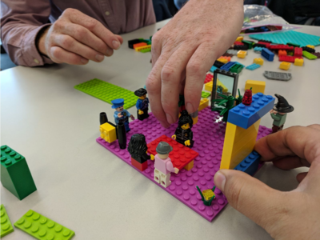

# Lean UX Lego

## Purpose

Learn the lean ux principles of Learn / Build / Measure using lego.

- `Type:` Team Game
- `Time Needed:` 35 min
- `Number of people per team:` 3

## Supplies Needed

- Lego, enough to build something !

## The Goal of the game

The goal of the game is to practice and learn lean UX design principles. Choose a topic between each team that solves the customers problem (each customer can come up with there own issue - e.g "The Customer would like a better Mobile Phone Holder for their car!")

Uses the following techniques:

1. User interview
2. Usability Testing
3. Iterative build and design
4. Demonstrate working product

## Rules for playing the game

1. In teams of 3, Choose
   1. one person to be the customer
   2. one person in team to be the builder
   3. one per in the team to be the designer

Time box the following activities, have 3 sprints:

1. 2 min - User interview between designer and customer
2. 3 min - Build session, designer and builder
3. 2 min - Demonstrate the product back to customer and feedback

## Debrief:

- Go around teams, see what worked well what didn't work well
- Ask teams to showcase their creations ! fun
- Discuss Lean UX, the importance of iterative learn/build/measure
- Test often, Test early

