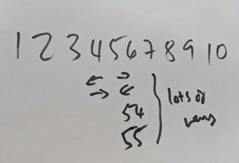

# The 1 to 10 Game

## Purpose

There are many ways to solve a problem. Participants need to add up the numbers 1 to 10 in there heads.

- `Type:` Short Intro Game
- `Time Needed:` 5-10 Minutes
- `Number of people per team:` All

## Supplies Needed

- A Slide/Whiteboard with the numbers 1,2,3,4,5,6,7,8,9,10 on it

## The Goal of the game

The goal of the game is for participants to add the numbers up in their heads. Remember the total, then ask participants for it. You may surprisingly get different answers (10 numbers, 55 right answer, 54 counted wrong) etc.

## Rules for playing the game

1. No rules, just gameplay

## Debrief:

- Ask a few participants how they solved the problem.
- Some will solve it from outside in, others from inside out (along row of numbers).
- Some may have neat mathematical tricks
- The lesson here is that there are many ways to solve a problem.

