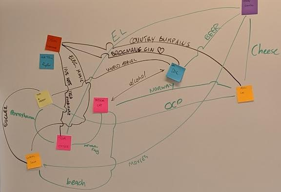

# Network Mapping

## Purpose

This is an icebreaker game, suited for participants to get to know each other.

- `Type:` Ice Breaker
- `Time Needed:` 15 min
- `Number of people per team:` All play

## Supplies Needed

- Whiteboard and whiteboard markers are ideal

## The Goal of the game

The goal of the game is for participants to learn something in common between themselves and another participant.

1. Sticky note with your name and animal (or job title)
2. Put these on the whiteboard.

- Repeat (3-5) as many times (say minimum 3) as you need, large groups need to limit time.
  
3. Form 2 lines, people facing each other
4. 1 minute time-box to find something in common between the two participants facing each other
5. Write on whiteboard the Commonality and A Network Line between the participants.

## Rules for playing the game

1. No real rules

## Debrief:

- Talk to the network diagram, commonalities between participants who do not know each other.

