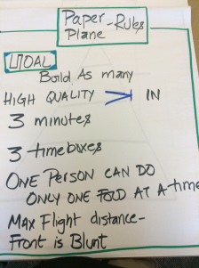
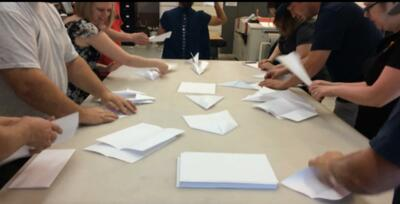

# Paper Planes

## Purpose

To demonstrate the power of time-box or Sprint that makes the heartbeat of an agile framework like Scrum. How many can you build in three minutes?

- `Type:`  Team Game
- `Time Needed:` 45 minutes
- `Number of people per team:` 6

## Supplies Needed

- Used Printer Paper 50 per team
- One flip chart and a marker to keep score

## The Goal of the game

The goal of the game is for each team to create as much high quality tested planes that can fly a distance of at least 30 meters . The world record holder last checked in June 2016 was somewhere in Germany.

Each iteration last 9 minutes.

1. - 3 minutes for planning.
2. - 3 minutes of actual build ( test included) time.
3. - 3 minutes for review/retrospective.

## Rules for playing the game

1. Build as many paper planes as you can in a 3-minute time box.
2. One player can only do one fold at a time. That rules stays true for all three time-boxes.
3. The planes should be built and tested in the 3-minute increment.
4. Only planes that cross >2-3 meters will be counted.
5. Each team should give a count of how many planes they are going to build before the time-box starts.
6. Subtract the final count of planes that actually flew from the planes that were built but were not tested or completed.  Eg: Team A said they will make 4 planes, 7 planes flew all the way but 5 were WIP ( work in progress). Subtract WIP so the actual is 7-5 =2
7. The team has to come up with one idea of improvement at the retrospective. Have one member in the team be the counter.
8. The front of the plane should be blunt to avoid injury to the team members.
9. You cannot crush the plane into a ball and throw.

## Debrief: (PICK ANY TWO)

1. Each table talks about what made them improve over the three iterations
2. Talk about what would have happened if the time box was not there
3. Talk about how waterfall may be different from this.
4. Talk about who made the final design decisions in the team.
5. Talk about any wastes they removed from the system that helped them get better.

